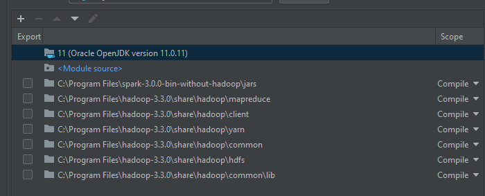
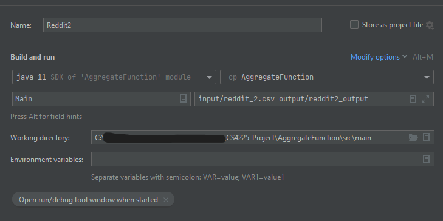

# Post Processing Code - AggregateFunction

## Description
The purpose for this set of codes is to process the output of the results that come out from the Lexicon-Based and Machine Learning model. 
This code is to be used for reducing the number of rows of data so that the total number of rows does not
exceed the Tableau Public data limit of 15 million rows.

## Setup
1. Ensure that Hadoop and Spark jars libraries are already added in the dependencies. Make sure that the spark jars file is 
placed before the hadoop files as shown here.

2. Add all the processed data files under an input folder in this project. 

3. Set up the running configurations as shown in the following screenshot. Take note of the working directory where you place your project folder in.

5. Run the configurations and you will see an output folder with the csv file required for the Tableau visualizations later.